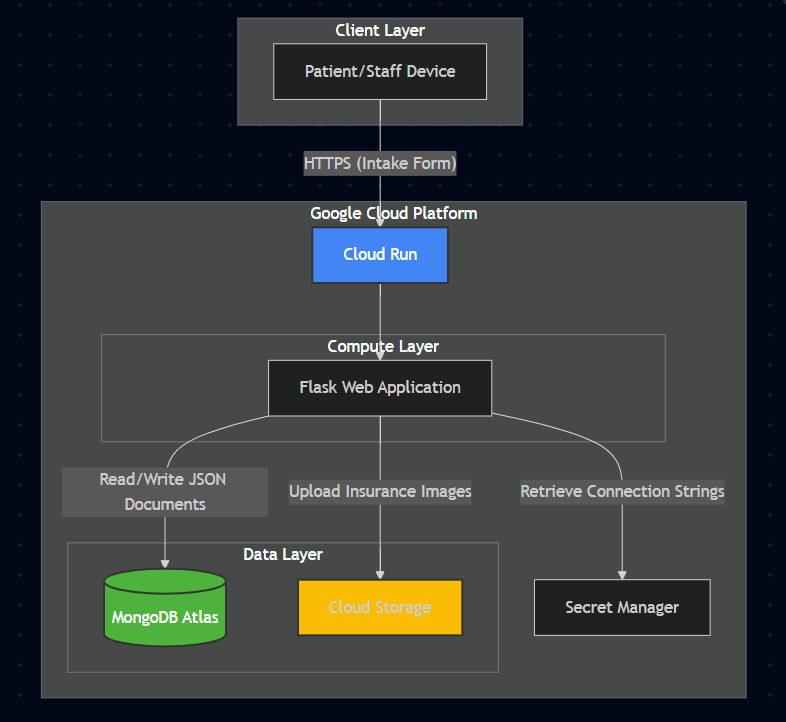

# Architecture Plan: Patient Intake and Triage System

## Overview
This section describes the cloud architecture for a patient intake and triage system designed for small healthcare clinics. This system uses Google Cloud Platform (GCP) and MongoDB Atlas. 

## 1. Service Mapping 
The following table maps each architectural layer to specific services and connects them to relevant course modules:

| Layer | Service (GCP) | Role in Solution | Related Assignment/Module |
|-------|---------------|------------------|---------------------------|
| Frontend / Access | Cloud Run | Hosts the containerized Flask web application that serves the patient intake forms and staff dashboards | Assignment 2: VM's and Networking with Flask |
| Compute | Docker | Packages the Python application with all dependencies for consistent deployment | Module 10: Compute w/ Docker - Cloud Run (GCP) |
| Database | MongoDB Atlas | Stores patient documents, flexible symptom responses and triage scrores | Module 8: Nosql and Assignment 5: MongoDB Basics |
| Storage (Files) | Cloud Storage | Stores uploaded patient documents (insurance card images) in a secure, private bucket | Module 6 - Cloud Storage |
| Security | Secret Manager | Securely manages MongoDB connection strings and API keys. | Module 1: Cloud Introduction and Assignment 5: MongoDB Basics |


## 2. Data Flow Narrative

### Step 1: Patient Accesses Intake Form
A patient arrives at the clinic and accesses the intake form either via:
- A clinic-provided tablet/kiosk, or
- Their personal smartphone by scanning a QR code
The Flask application serves an HTML form with fields for demographics, chief complaint, symptom checklist, and optional file upload for insurance cards.

### Step 2: Form Submission to Flask API
When the patient submits the form:
- A `POST` request sends JSON data to the `/api/intake` endpoint
- If an image file is attached, it is sent as `multipart/form-data`
- The Flask application validates required fields and sanitizes input

### Step 3: Data Persistence
The Flask backend performs two storage operations:

**Structured Data → MongoDB Atlas:**
```
Patient demographics, symptoms, and timestamps are inserted as a single 
document into a MongoDB collection (e.g., 'patients'). 
All symptom responses are nested within the patient document 
for better performance and flexibility.
```

**File Uploads → Cloud Storage:**
```
Insurance card images are uploaded to a private Cloud Storage bucket.
The file's GCS URI or path is stored within the MongoDB patient document 
for easy retrieval.
```

### Step 4: Triage Score Calculation
Immediately after data persistence, a triage scoring function executes:
- Analyzes symptom keywords (e.g., "chest pain" = high priority)
- Considers patient-reported pain level (1-10 scale)
- Assigns a triage priority level (1=Emergent through 4=Non-Urgent)
- Updates the existing MongoDB document with the calculated triage score

### Step 5: Staff Dashboard Retrieval
Front desk staff access the `/dashboard` route which:
- Queries MongoDB Atlas for all documents where status = "waiting"
- Sorts results by triage priority (ascending) then check-in time
- Displays a real-time queue with patient name, chief complaint, and priority badge

### Step 6: Clinician Patient View
When a clinician selects a patient from their queue:
- The application fetches the full intake document from MongoDB
- If documents exist in Cloud Storage, it generates a signed URL (valid for a limited time: 20 minutes etc.)
- The clinician views all patient-submitted information on a single detail page

### Step 7: Visit Completion
After the encounter:
- Clinician clicks "Complete Visit"
- The patient document is updated with status = "completed" and a timestamp
- The patient is removed from active queues/dashboards

## 3. Security, Identity, and Governance Basics
Summary:
- Credential Management: All sensitive credentials, such as the MongoDB connection string, are managed via GCP Secret Manager and injected as environment variables.
- Access Controls: Access to cloud resources is governed by IAM roles; for example, the Cloud Run service account is the only identity permitted to read/write to the specific Cloud Storage bucket
- PHI Protection: To ensure HIPAA-readiness, all data is encrypted at rest and in transit (HTTPS/TLS). 

- For this project, all sensitive data such as the MongoDB Atlas connection string and API keys would be managed using GCP Secret Manager rather than being hard-coded or stored in simple environment variable files. The Cloud Run service account is granted the Secret Manager Secret Accessor role, allowing it to securely retrieve these secrets at runtime. This prevents credentials from being committed to version control and ensures that even if the source code is exposed, the database remains protected. Role-Based Access Control (RBAC) ensures users only access the data necessary for their job functions. Patients have "write-only" access to the intake form with no ability to view other records. Front Desk Staff are assigned a role that allows them to view and manage the patient queue but restricts access to detailed medical clinical notes. Clinicians have a role granting full read access to clinical data for their assigned patients while limiting administrative or billing privileges. From a high level, this app would avoid putting PHI into public environments by: avoiding PHI in metadata, build logs, or unencrypted storage. Data would be encrypted a rest and in transit. 


## 4. Cost and Operational Considerations
- The primary cost driver in this architecture is the managed database, MongoDB Atlas, as database instances typically incur higher costs than serverless compute. While Cloud Run and Cloud Storage are inexpensive for the low-to-medium traffic of a local small clinic, the data layer requires consistent availability. However, by utilizing the MongoDB Atlas "M0" free tier and Cloud Run’s monthly allowance of 2 million requests, the operational cost for a prototype would remain low.
- To maintain a "student budget," this design intentionally avoids always-on Virtual Machines (VMs). Cloud Run only bills for the exact duration of a request, meaning the clinic pays nothing overnight or during low-traffic periods. Furthermore, by using Cloud Storage lifecycle policies to move older insurance images to "Nearline" or "Archive" storage classes, we ensure that long-term data retention does not lead to unexpected storage fees. 

# Architecture Diagram
Diagram created using Mermaid Live Editor: 
